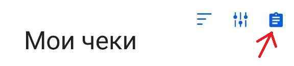
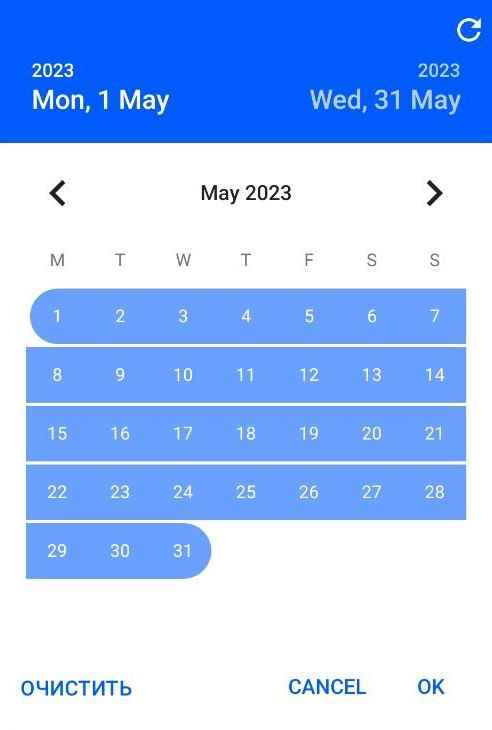
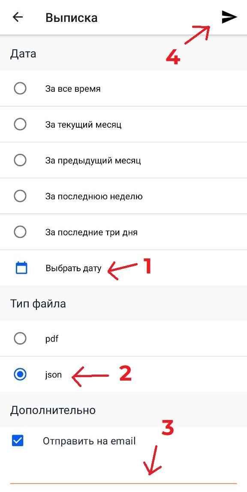

# ShopParser

This application allows you to present information about checks in a convenient way, which can be used for analyzing expenses later.

## Setup

1) Install the "[Checks of the Federal Tax Service of Russia](https://play.google.com/store/apps/details?id=ru.fns.billchecker)" app 
2) Authorize and click export button 
3) Select date range 
4) Select json and send to a preferred email address 